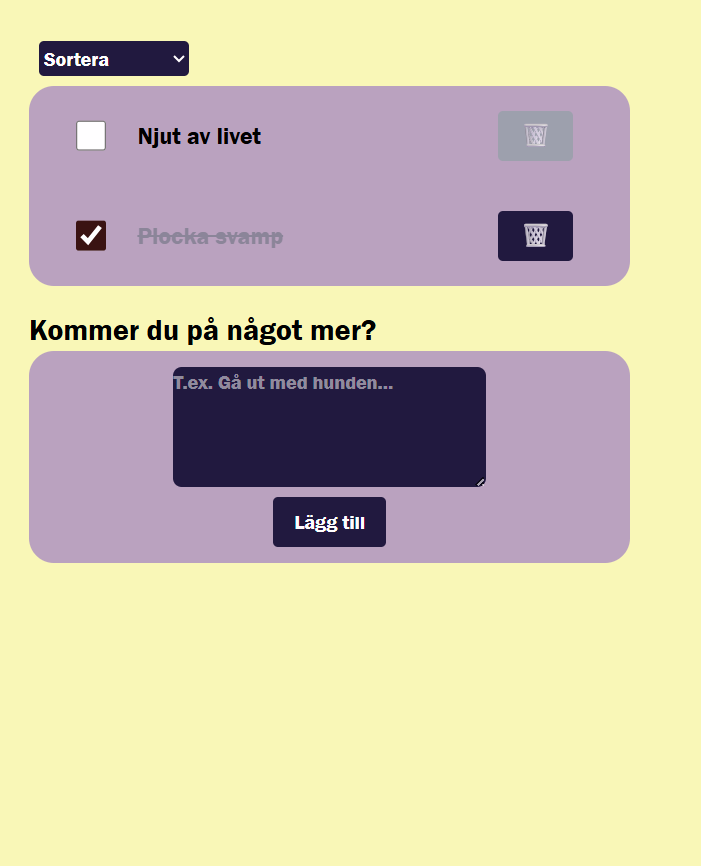
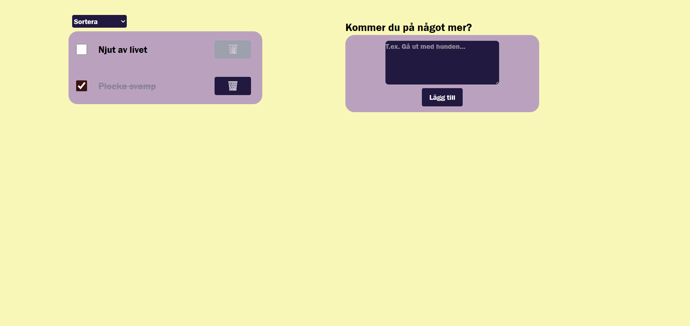
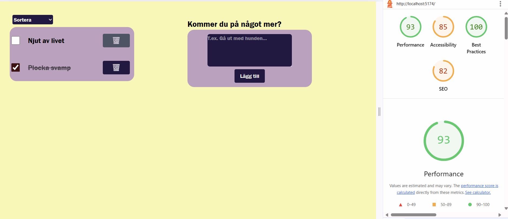

# TodoApp
Welcome to my todo app, my very first React project built with TypeScript!
This simple application demonstrates my understanding of fundamental React concepts such as components, state, props, and event handling. The project is a classic todo list with interactive functionality and modular code structure.

## ✨ Features
- A hardcoded list of todo items, created using useState

- Clear separation of concerns with multiple components for structure and presentation

- Ability to mark todos as done via an onChange event that toggles isDone to true

- Ability to delete a todo item using an onClick event and array filtering logic
  
- LocalStorage integration to persist todos between sessions

- A form component (AddTodo) that allows users to add new tasks

- Sorting functionality for the todo list:

    * Alphabetical order (A–Ö)

    * Reverse alphabetical order (Ö–A)

- Responsive styling using Tailwind CSS

  ## 🛠 Tech Stack
  
  

  

  

  ## Screenshots
  **Mobile view**
  
  

  **Tablet view**
  
  

  **Desktop view**
  
  

  ## Validation
  

  ## 🤝 Credits
  This project was developed as part of the curriculum at Medieinstitutet during my first year of studies.
