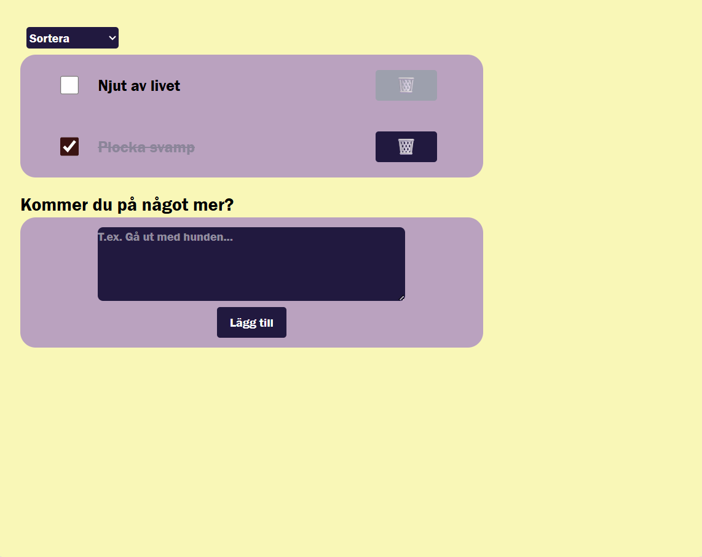

# TodoApp
Welcome to my todo app, my very first React project built with TypeScript!
This application is a further development of my previously created TodoApp, with the purpose of exploring end-to-end testing (E2E) using Cypress.

It demonstrates my understanding of fundamental React concepts such as components, state, props, and event handling, while also showcasing how automated tests can validate user flows and ensure the reliability of the app.

  ## ✨ Features
  - A hardcoded list of two todo items, created using useState:
      * "Njut av livet" (already marked as done)

      * "Mejla handledare" (not done)

  - Clear separation of concerns with multiple components for structure and presentation

  - Ability to mark todos as done via an onChange event that toggles isDone to true

  - Ability to delete a todo item using an onClick event and array filtering logic

  - A todo can only be deleted if it is marked as done (for testing purposes).
    
  - LocalStorage integration to persist todos between sessions

  - A form component (AddTodo) that allows users to add new tasks

  - Sorting functionality for the todo list:

      * Alphabetical order (A–Ö)

      * Reverse alphabetical order (Ö–A)

  - Responsive styling using Tailwind CSS

  ## ✅ Testing
  This project includes end-to-end testing (E2E) using Cypress. E2E tests were chosen to validate the entire flow of the application and ensure that different components work correctly together.

  ### Tested scenarios

  - Initial render
    * Application loads with two default todos.

    * One todo is marked as done, the other is not.

  - Add new todos
    * User can add a new todo via the form, and it appears in the list.

  - Todo state
    * A todo can be toggled between done and not done.

    * Toggling updates both the checkbox state and the visual style (line-through).

  - Delete button behavior
    * Delete button is disabled when a todo is not marked as done.

    * A todo cannot be deleted if it is not done.

    * A todo can be deleted if it is already done.

    * A todo can be deleted after being marked as done.

  ## 🛠 Tech Stack
  
  

  

  

  

  ## Screenshots
  **Mobile view**
  
  

  **Tablet view**
  
  

  **Desktop view**
  
  

  ## Validation

  ### LightHouse
  

  ### Cypress
  

  ## 🤝 Credits
  This project was developed as part of the curriculum at Medieinstitutet during my second year of studies.
